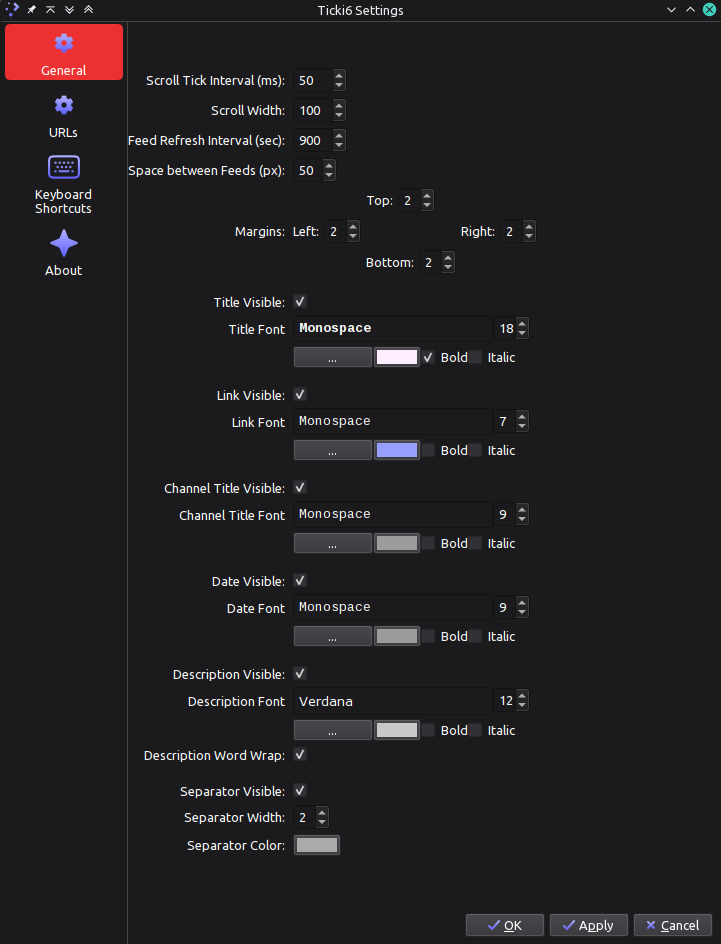
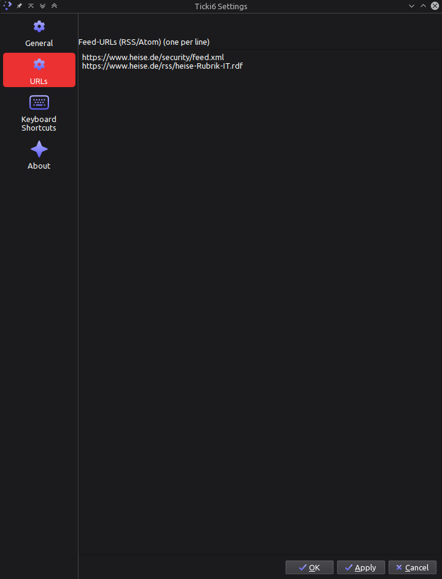

# Ticki6

Simple Newsticker for your KDE/Plasma6 Panel

- reads Atom-Feeds
- reads RSS-Feeds
- scrolls Feed Items from left to right and back
- click on Feed Item opens default Browser

Screenshot:

Screenrecord in action: 

Screenshots (Config)

